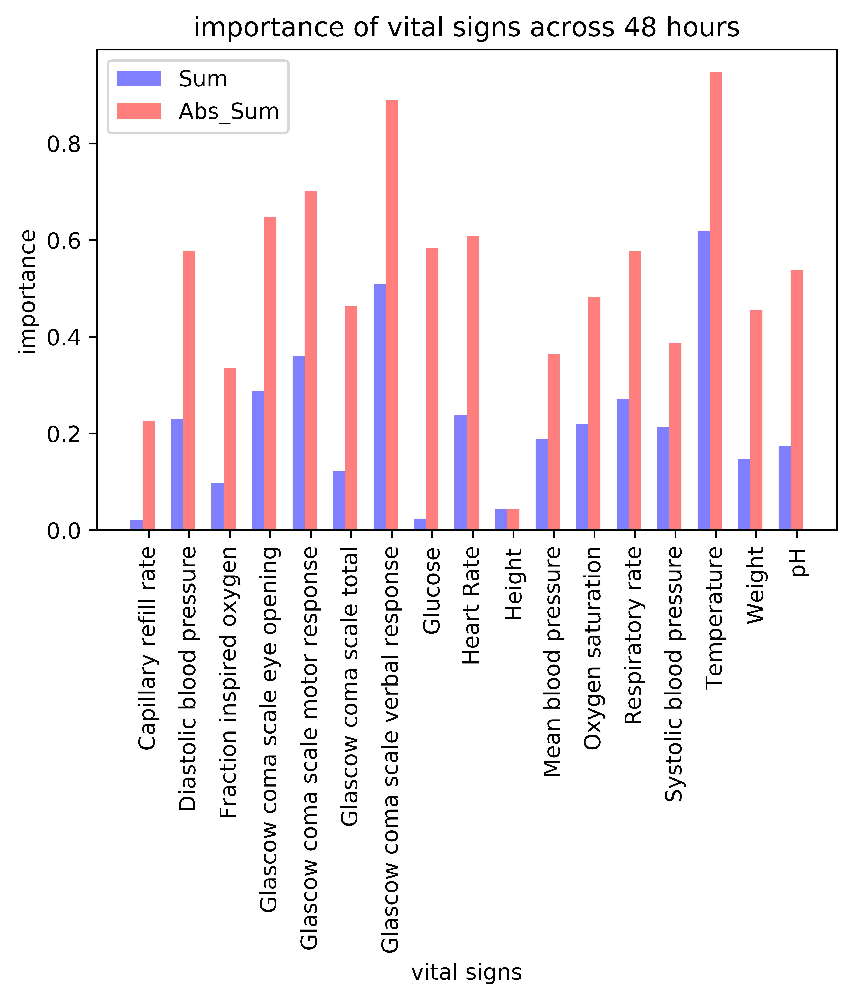

# data_incubator_plot1
Display of analysis plot 1

## Importance of Vital Signs
By analyzing the coefficient of logistics regression whose independent variables are generated by 48 hours of vital signs and dependent variable is mortality, we give a briefly analysis on the vital sign importance to mortality.
   
# Display of result
Here are the top 4 signs:
1 .  Temperature
2 .  Glascow coma scale verbal response
3 .  Glascow coma scale motor response
4 .  Glascow coma scale eye opening

Following are secondary important signs:
Heart Rate
Diastolic blood pressure
Respiratory rate
Oxygen saturation
pH

